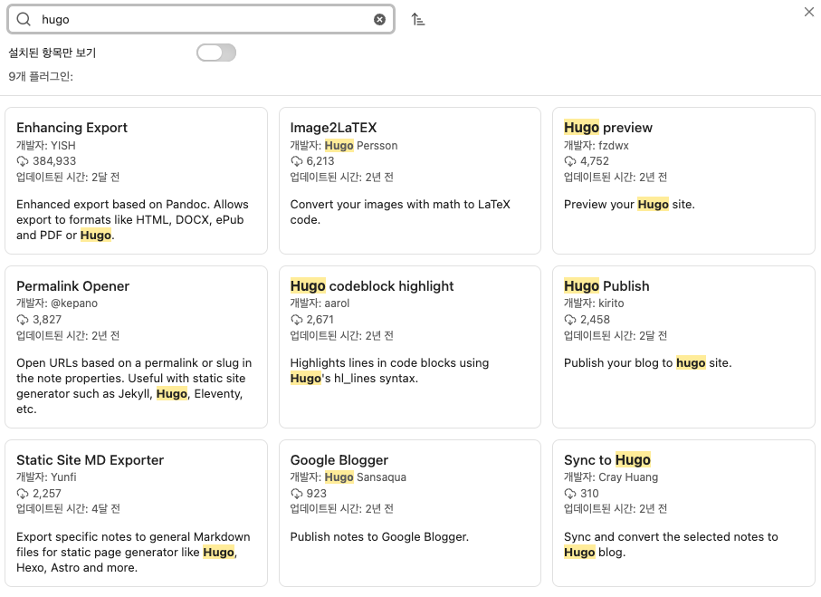
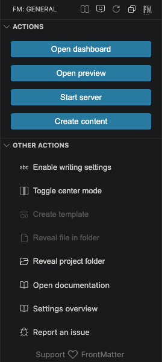

# TEST POST

여기에 포스트 작성

<figure>
  
  <figcaption>캡션 텍스트</figcaption>
</figure>

<figure style="text-align: center;">
  
  <figcaption style="color: gray; font-size: 0.9em;">캡션 텍스트</figcaption>
</figure>



  
  
  
test test test test test test test test 

